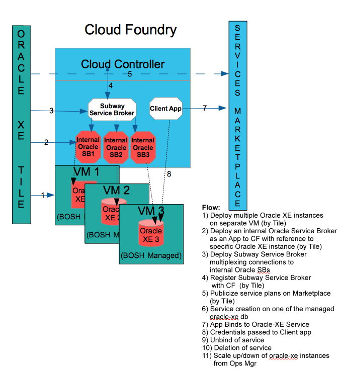

# BOSH Oracle XE Release (Experimental)

BOSH Release for Oracle XE development database + Service Broker (Experimental)

`WORK IN PROGRESS NOT READY, FEW BUGS, NEEDS BETTER DOCUMENTATION AND REFACTORING. PULL REQUESTS WELCOME`	

This is a bosh release for installing and running Oracle XE database instance for purely dev purpose on BOSH managed infrastructure. The release would also deploy a Java based [Oracle Service Broker] (https://github.com/viniciusccarvalho/cf-oracle-servicebroker) app that would broker and manage the Oracle XE instance for use with Cloud Foundry based apps. BOSH would manage the creation of a new vm and installation/management of the Oracle XE instance. Bosh would also push the Java based service broker app on CF connecting to the XE instance. Please refer to the service broker app for more details on managing and interacting with the app. The XE instance would be managed by BOSH while the bundled service broker would be managed by CF.

The prebuilt tile is available (but without the Oracle XE binary install) in this repo.
The Oracle XE linux rpm install binary should be made available from some address/location provided either to the tile during install or to BOSH.

# Architecture

Please refer to the [documentation] (./docs/OracleXEServiceBrokerTile.pdf) for more details on the architecture.

#Notes

Download the [Oracle XE Install] ( http://www.oracle.com/technetwork/database/database-technologies/express-edition/downloads/index.html) for Linux x64 bit version and make it available on the network for download by Bosh.

